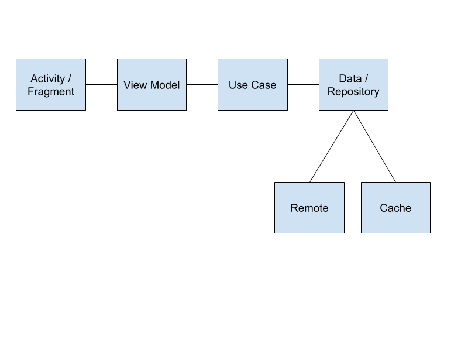

# Android-NewsApp

Simple News app build using [https://newsapi.org](https://newsapi.org)

The app is based on MVVM architecture, principles of clean code and is split across multiple modules. The app uses android libraries such as RXJava2, Dagger2, JUnit etc.

## App Architecture

## ScreenShots

 &nbsp; &nbsp; &nbsp; &nbsp; 
